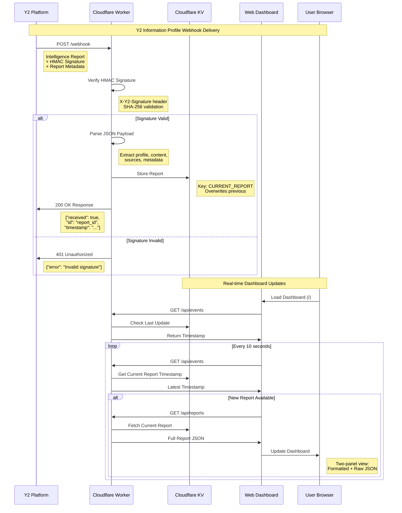

# Y2 Webhook Receiver for Cloudflare Workers

A simple webhook receiver that accepts Y2 platform intelligence reports and displays them in a basic web UI.

## Features

- ✅ Receives Y2 platform webhooks at `/webhook` endpoint
- ✅ HMAC signature verification for security
- ✅ Stores reports in Cloudflare KV storage
- ✅ Simple web UI to view received reports
- ✅ Auto-refresh dashboard every 30 seconds

## Webhook Flow

The following sequence diagram shows how Y2 Information Profile webhooks are delivered and processed:



## Quick Start

### 1. Install Dependencies

```bash
bun install
```

### 2. Configure KV Namespace

Create a KV namespace in Cloudflare:

```bash
bunx wrangler kv namespace create REPORTS
```

Create or update `wrangler.toml` with your KV namespace ID from the output above.

### 3. Set Webhook Secret

Edit `wrangler.toml` and replace `your-webhook-secret-here` with your actual secret from [Y2](https://y2.dev/dashboard/infoops/settings):

```toml
[vars]
WEBHOOK_SECRET = "your-actual-secret-here"
```

### 4. Local Development

```bash
bun run dev
```

Visit `http://localhost:8787` to see the dashboard.

### 5. Deploy to Cloudflare

```bash
bun run deploy
```

After deployment, you'll get a URL like `https://y2-webhook-receiver.YOUR-SUBDOMAIN.workers.dev`

## Y2 Platform Configuration

Configure your Y2 platform webhook with:

- **URL**: `https://your-worker.workers.dev/webhook`
- **Secret**: The same secret you set in `wrangler.toml`
- **Headers**: Any custom headers you need

## Endpoints

- `GET /` - Web dashboard showing received reports
- `POST /webhook` - Webhook endpoint for Y2 platform
- `GET /api/reports` - JSON API to fetch stored reports

## Testing

Test the webhook locally using curl:

```bash
curl -X POST http://localhost:8787/webhook \
  -H "Content-Type: application/json" \
  -H "X-Y2-Signature: sha256=your-signature" \
  -H "X-Y2-Report-ID: test-123" \
  -d '{
    "type": "y2_intelligence_report",
    "id": "test-123",
    "timestamp": "2025-01-30T12:00:00.000Z",
    "profile": {
      "name": "Test Profile",
      "topic": "Test Topic"
    },
    "content": {
      "html": "<h1>Test Report</h1>",
      "text": "Test report content",
      "smsSummary": "Test summary",
      "sources": ["https://example.com"]
    }
  }'
```

## Security Notes

- Always use HTTPS in production
- Keep your webhook secret secure
- The worker verifies HMAC signatures when a secret is configured
- Reports are stored in KV with automatic cleanup (keeps last 50)
